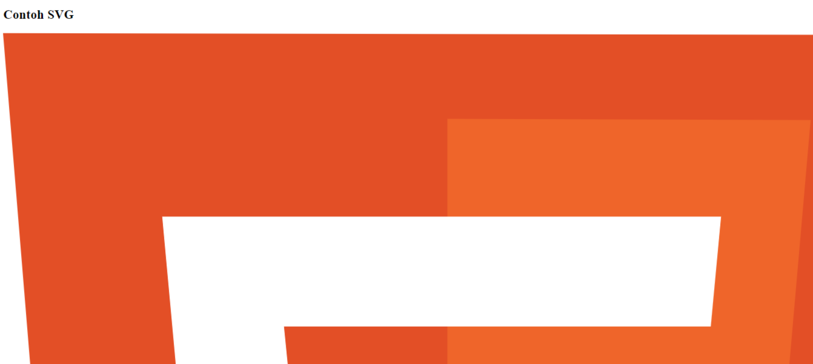
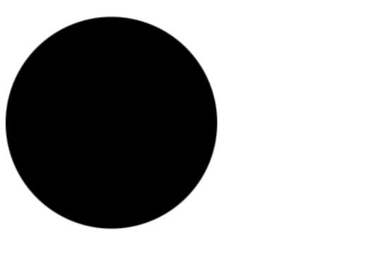
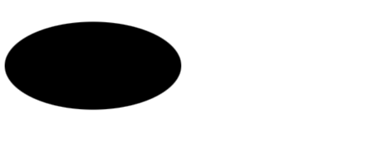

# HTML SVG

## Apa itu HTML SVG?

Scalable Vector Graphics (SVG) adalah sebuah file gambar yang berformat vektor, baik berupa bentuk sebuah garis, stroke, diagram, peta, atau gambar-gambar ilustrasi lainnya.

Dalam penulisannya SVG menggunakan XML (Extensible Markup Language) sebagai dasar untuk membentuk gambar vektor dua dimensi.

## Mengapa harus menggunakan SVG?

Ada beberapa alasan mengapa harus menggunakan SVG, di antaranya :

- Ketika diperbesar gambar svg tidak pecah.
- Bisa dibuat dan dimodifikasi dengan text editor.
- Bisa dijadikan animasi.
- File SVG lebih kecil dan _scalable_.
- Mudah untuk dikompres dibandingkan format lain.

## Bagaimana cara menggunakan SVG?

1. **Menggunakan SVG pada tag ``**

   Cara yang paling mudah untuk menerapkan gambar SVG pada sebuah web adalah cukup sisipkan svg pada element `` dan berikan penjelasan dengan atribut `alt`, seperti ini :

   ```html
   
   ```

   

   karena ukurannya cukup besar maka kita atur lebarnya seperti ini :

   ```html
   
   ```

   

2. **Menggunakan SVG pada inline html**

   Langsung ditulis pada document html dengan memberikan tag `<svg>`.

   ```html
   <body>
     <svg
       fill="none"
       height="2500"
       width="2183"
       xmlns="http://www.w3.org/2000/svg"
       viewBox="0 0 124 141.53199999999998"
     >
       <path
         d="M10.383 126.894L0 0l124 .255-10.979 126.639-50.553 14.638z"
         fill="#e34f26"
       />
       <path
         d="M62.468 129.277V12.085l51.064.17-9.106 104.851z"
         fill="#ef652a"
       />
       <path
         d="M99.49 41.362l1.446-15.49H22.383l4.34 47.49h54.213L78.81 93.617l-17.362 4.68-17.617-5.106-.936-12.085H27.319l2.128 24.681 32 8.936 32.255-8.936 4.34-48.17H41.107L39.49 41.362z"
         fill="#fff"
       />
     </svg>
   </body>
   ```

3. **Menggunakan SVG pada tag `<iframe>`**

```html
<iframe src="html-icon.svg" width="800" height="1200"></iframe>
```

> Tidak disarankan untuk menggunakan tag `<iframe>` karena akan sulit untuk di _maintain_ dan dampak buruk bagi SEO.

4. **Menggunakan SVG pada CSS**

Hampir mirip caranya seperti tag ``, hanya saja kali ini diterapkan pada CSS.

```css
body {
  background-image: url(html-icon.svg);
}
```

## Element SVG

SVG memiliki banyak element di antaranya :

- `<circle>`

```html
<svg viewBox="0 0 100 100" xmlns="http://www.w3.org/2000/svg">
  <circle cx="50" cy="50" r="50" />
</svg>
```



- `<ellipse>`

```html
<svg viewBox="0 0 200 100" xmlns="http://www.w3.org/2000/svg">
  <ellipse cx="100" cy="50" rx="100" ry="50" />
</svg>
```



- `<line>`

```html
<svg viewBox="0 0 100 100" xmlns="http://www.w3.org/2000/svg">
  <line x1="0" y1="80" x2="100" y2="20" stroke="black" />
</svg>
```


- `<rect>`

```html
<svg viewBox="0 0 220 100" xmlns="http://www.w3.org/2000/svg">
  <rect width="100" height="100" />
</svg>
```


Untuk selengkapnya kunjungi [MDN - SVG element reference](https://developer.mozilla.org/en-US/docs/Web/SVG/Element#svg_elements_a_to_z)

## Sumber :

- [How to Use SVG Images in CSS and HTML – A Tutorial for Beginners](https://www.freecodecamp.org/news/use-svg-images-in-css-html/)
- [MDN - What is SVG?](https://developer.mozilla.org/en-US/docs/Learn/HTML/Multimedia_and_embedding/Adding_vector_graphics_to_the_Web#what_is_svg)
- [Medium - Membuat Peta Geografis HTML dengan SVG](https://medium.com/@dede.brahma2/membuat-peta-geografis-html-dengan-svg-c03e04987552)
- [Codepolitan - Membuat UI Website Modern dengan SVG](https://codepolitan.com/blog/membuat-ui-website-modern-dengan-svg-5b5980354860b)
